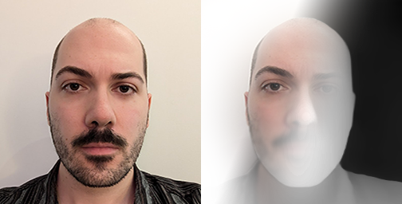

# face-processing
## no-click executable for facial photo integration in games 

Unitasker executable. Takes in an RGB photo of a face and spits out a repacked .tga or .png where the alpha channel is an inferred depth of the face and the RBG is blurred and adjusted.

### Setup

- Download the [dpt_beit_large_384](https://docs.doji-tech.com/com.doji.midas/manual/models.html) model and copy it to your Assets/Resources folder. 
- Build the application for desktop.
- Make a shortcut to the application somewhere. Add "-batchmode" to the target to make the app run headless.
- Drag a preferably square, preferably under 512px png or jpeg  onto the shortcut.

### Credits

[- Uses The MiDas Unity Sensis implementation by Julien Kipp](https://github.com/julienkay/com.doji.midas)
[- Guts grifted from my own no-click normalizer plugin](https://github.com/alexismorin/Normalize)